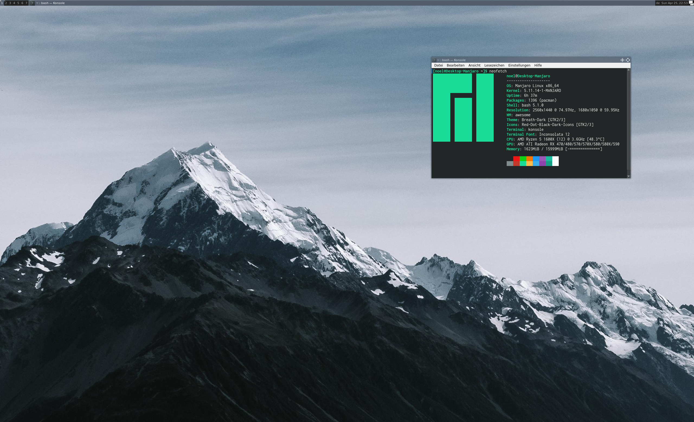

#### Build in progress
# awesome window manager config
My configuration for the awesome window manager

### What you have to install
* awesome
* dmenu
* pcmanfm
* nitrogen
* spotify-cli
* acpi

### default programms (change them in the config if you dont want them)
* Konsole 
* Firefox
* sublime-text
* pcmanfm
* spotify

#### **Notice** 
this config comes with a standard monitor resolution setting. Please deactivate it in the config or just use my weird monitor arangment if you want.

